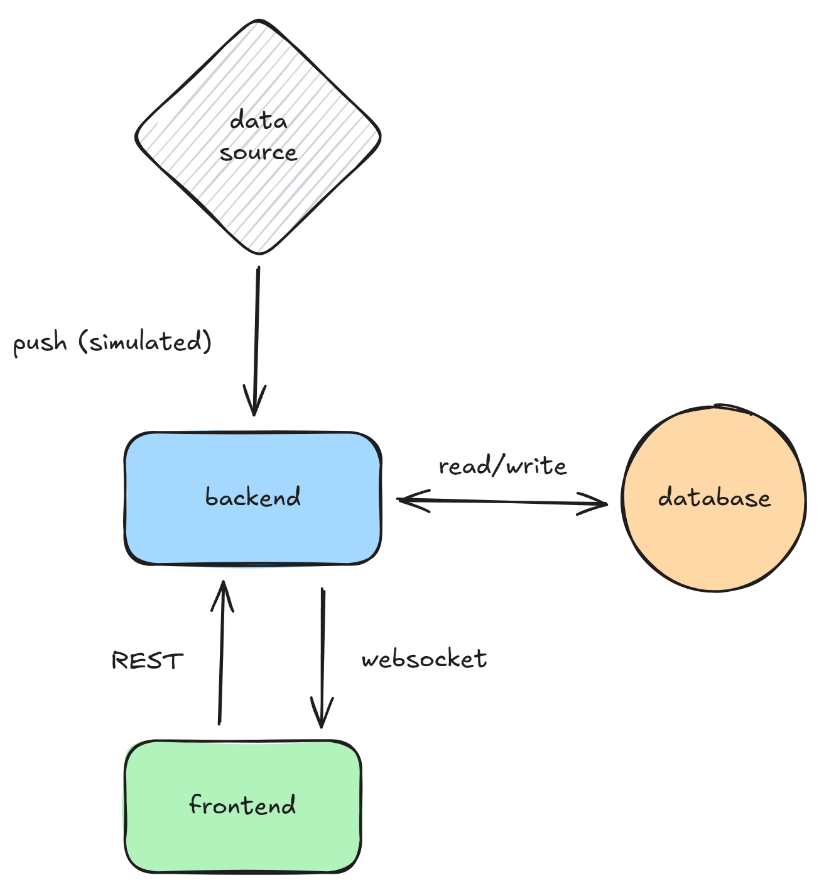

# ⚡ Real-Time Sports Dashboard

A real-time web dashboard for live sports matches showcasing streaming data, WebSockets, and user-facing features.

## 🚀 Core Features
- **Live Match Feed**: Fetch live/simulated sports data, broadcast via WebSockets.  
- **Real-Time UI**: Match score + timeline of goals, cards, substitutions.  
- **Latency Metrics**: Measure & display event propagation speed.  

## 🛠️ Tech Stack
- **Frontend**: Next.js, TypeScript  
- **Backend**: Node.js, Fastify, WebSockets, TypeScript, Kysely
- **Database**: PostgreSQL

## ⚖️ Tech Choices & Rationale

### Backend
- **Fastify**
  - **Pros**: Very fast, lightweight, built-in request validation.
  - **Cons**: Smaller ecosystem than Express, so fewer ready-made integrations.  

- **WebSockets**
  - **Pros**: True real-time communication with low latency.  
  - **Cons**: Persistent connections are harder to scale, they require sticky sessions or a shared state layer like Redis pub/sub to handle load balancing and fault tolerance.

- **REST**
  - **Pros**: Simple, well-known standard and quick to implement. 
  - **Cons**: Less flexible than GraphQL for complex data fetching.

- **Kysely**
  - **Pros**: Type safe query builder. Reduce runtime errors and adds more flexibility than using an ORM. Also better typing than Knex with a similar API.
  - **Cons**: Smaller ecosystem than Prisma or other ORM. DX a little bit less friendly than Knex for query building.

### Database
- **PostgreSQL** 
  - **Pros**: Reliable and complete relational DB with good support for structured and semi-structured data like JSON. Also a standard at this point.  
  - **Cons**: Heavier to set up than in-memory options for quick prototypes like Sqlite.

### Language & Tooling
- **TypeScript** 
  - **Pros**: Better developer experience, reduces bugs, safer refactoring, more maintainable codebase.  
  - **Cons**: Adds build step and stricter typing overhead, which can slow down rapid prototyping.

### Frontend
- **Next.js**  
  - **Pros**: Production-ready React framework with server/client/hybrid rendering, routing, and API routes out of the box. Great for fast development. Widely used, large ecosystem...  
  - **Cons**: Adds framework complexity and conventions on top of React. SSR/static generation overkill for small dashboards.  

## 🏗️ Architecture

